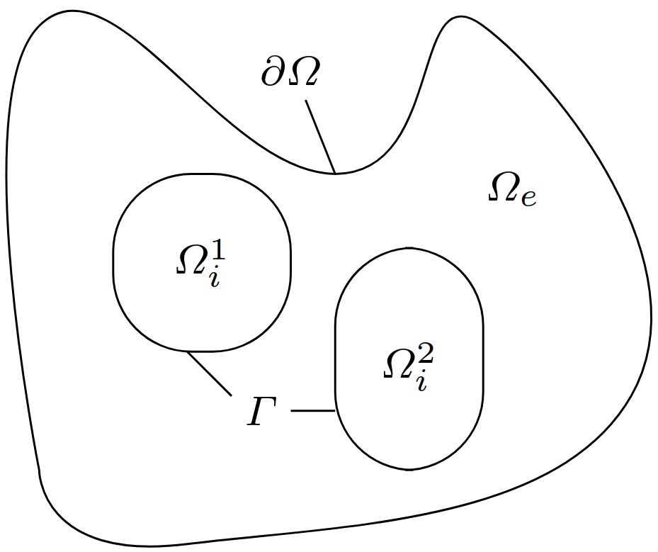

# The Extra, Intral Membrane (EMI) model

The EMI model is a way of modelling the intracellular, extracellular and membrane between the two explicitly.
A full introduction to the topic is given in {cite}`emi2021framework`. 

In this section, we limit ourselves two the following set of equations, with a single intra-cellular and extracellular space.

$$
\begin{align*}
-\nabla \cdot (\sigma_e\nabla u_e) &= 0&& \text{in } \Omega_e\\
-\nabla \cdot (\sigma_i\nabla u_i) &= 0&& \text{in } \Omega_i\\
\sigma_e\nabla u_e\cdot \mathbf{n}_e = - \sigma_i\nabla u_i\cdot \mathbf{n}_i &\equiv I_m&&\text{at } \Gamma\\
v &=u_e-u_i&& \text{at } \Gamma\\
\frac{\partial v}{\partial t} &= \frac{1}{C_m}(I_m-I_{ion})&& \text{at } \Gamma
\end{align*}
$$

:::{figure-md} markdown-fig


Illustration of the intracellular and extracellular space.
Figure is from {cite}`Benedusi2024` and is under the [creative commons license](http://creativecommons.org/licenses/by/4.0/).
:::

## Implementations

With the {term}`fem`, there are two classical ways of modelling Poisson-like equations,
namely the *primal* and *mixed* formulation.
However, as the EMI problem can be thought of as two Poisson problems with a specific coupling condition,
it expands the number of possible discretizations to four {cite}`Kuchta2021emi`:

- [The primal, single dimensional domain formulation](./emi_primal_single.py)
- [The primal, mixed dimensional domain formulation](./emi_primal_mixed.py)
- [The mixed, single dimensional domain formulation](./emi_mixed_single.py)
- [The mixed, mixed dimensional domain formulation](./emi_mixed_mixed.py)

## References

```{bibliography}
:filter: cited and ({"src/ucs/emi/emi"} >= docnames)
```